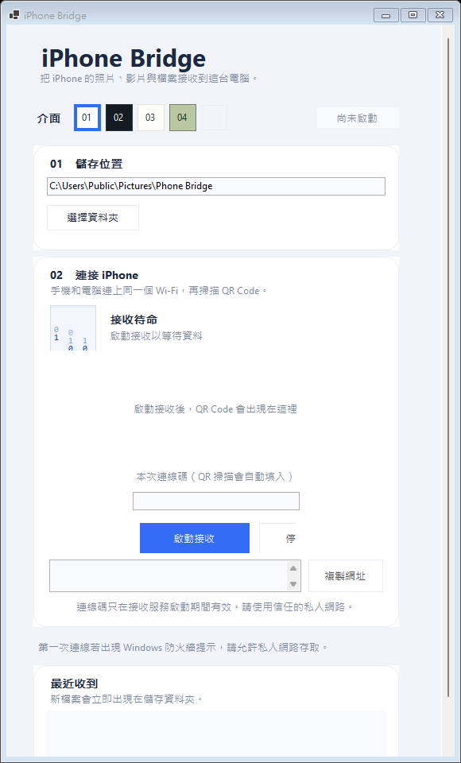
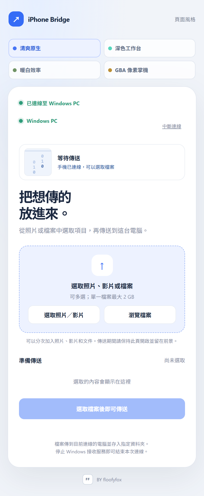
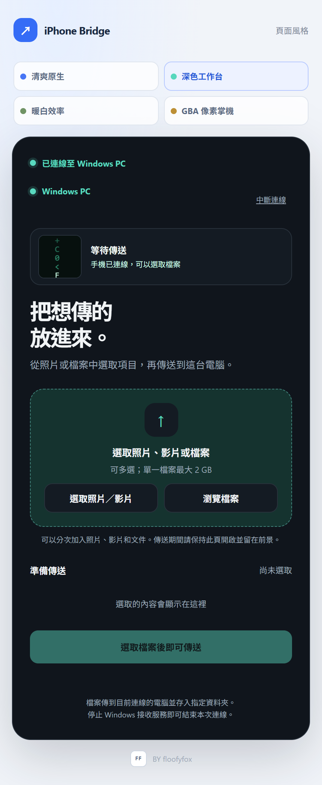
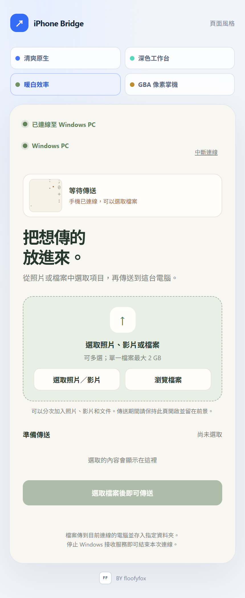
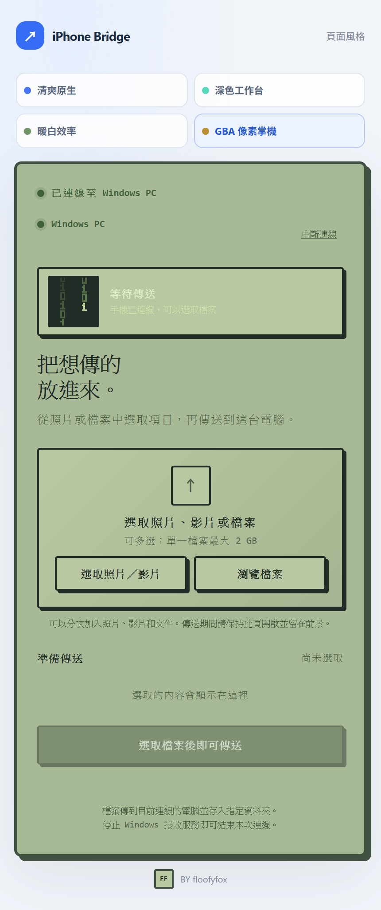

# Phone Bridge

本工具可將手機中的照片、影片與檔案，透過私人 Wi-Fi 傳送到 Windows 電腦。手機僅須使用瀏覽器連線，不需要安裝App。

> 本專案仍在開發中。Android Chrome 的選取與上傳流程已加入，尚未完成實體 Android 裝置驗證。如有問題請於issue通知。

## 下載與安裝

**一般使用者不需要建置專案，也不需要另外安裝 .NET。**

1. 前往 [下載最新版 Windows x64 安裝檔](https://github.com/Teafox113/iphone-bridge/releases/latest/download/IPhoneBridge-Setup-x64.exe)。
2. 下載後執行 `IPhoneBridge-Setup-x64.exe`，依照安裝程式完成安裝。
3. 從 Windows「開始」功能表開啟 **iPhone Bridge**。

安裝程式會安裝到目前 Windows 帳號，並建立開始功能表捷徑與解除安裝項目。程式目前提供 Windows x64 版本。

## 使用介面

### Windows 桌面



### 手機端四種皮膚

以下為手機端連線後、等待傳送時的介面示意；Windows 與手機網頁可切換相同的四種皮膚。

| 01 清爽原生 | 02 深色工作台 |
| --- | --- |
|  |  |
| 03 暖白效率 | 04 GBA 像素掌機 |
|  |  |

## 功能

- Windows 桌面接收程式，可選擇檔案儲存資料夾並查看最近收到的檔案。
- 啟動接收後顯示 QR Code、本機網址與本次 8 位連線碼。
- 手機瀏覽器支援選取多張照片、影片或一般檔案，並顯示傳輸進度。
- Android 手機提供「照片／影片」及「瀏覽檔案」兩種選取入口，可分次加入待傳清單。
- 傳輸中斷時，可重試尚未完成的檔案；已成功收到的檔案會保留在電腦。
- 檔案名稱會安全處理；遇到同名檔案時自動加上序號，避免覆寫。
- Windows 與手機網頁可使用四種介面：清爽原生、深色工作台、暖白效率、GBA 像素風格。

## 使用方式

1. 從 Windows「開始」功能表開啟 **iPhone Bridge**，選擇接收資料夾並按「啟動接收」。
2. 確認 Windows 電腦和手機連在同一個可互相通訊的私人 Wi-Fi。
3. 用手機相機掃描 Windows 顯示的 QR Code。也可以在手機瀏覽器開啟本機網址，再輸入 8 位連線碼。
4. 連線後，選取照片／影片或瀏覽手機中的檔案，再按傳送。
5. 收到的檔案會存入 Windows 設定的資料夾。按「停止接收」會關閉本次連線。

### Android 手機

建議使用最新版 Chrome。按「選取照片／影片」開啟手機媒體選取器；文件或其他檔案請按「瀏覽檔案」。傳送大型檔案時，請保持瀏覽器頁面開啟並留在前景；手機切換 App、鎖定螢幕或回收瀏覽器頁面時，系統可能暫停或中止傳輸。

### 使用條件

- Windows 電腦與手機必須連到同一個私人區域網路。訪客 Wi-Fi 或路由器的「用戶端隔離」設定可能阻止裝置互相連線。
- 第一次啟動時，Windows 防火牆可能詢問是否允許存取；請只對信任的私人網路開放。
- 單一檔案上限為 2 GB。失敗檔案重試時會從頭重新傳送，目前尚未支援單一檔案的分塊續傳。

## 開發者資訊

### 從原始碼建置

需要 Windows 電腦與 .NET 10 SDK。一般使用者請依照上方「下載與安裝」取得安裝程式。

在專案根目錄開啟 PowerShell，建置單一下載安裝檔：

```powershell
powershell.exe -NoProfile -ExecutionPolicy Bypass -File .\packaging\build-installer.ps1
```

建置完成後會產生 `release\IPhoneBridge-Setup-x64.exe`。安裝程式會安裝到目前 Windows 帳號的應用程式資料夾並建立開始功能表捷徑。

## 技術架構

- **Windows 桌面程式**：C#、WinForms、.NET 10
- **本機接收服務**：ASP.NET Core / Kestrel
- **手機端**：HTML、CSS、JavaScript；使用 iPhone Safari 或 Android Chrome 的系統檔案選取器
- **QR Code**：QRCoder
- **傳輸方式**：區域網路 HTTP，逐檔上傳至 Windows 接收服務

## 隱私與安全

- 接收服務僅綁定電腦的私人 IPv4 網路介面，不提供雲端或公網傳輸。
- 連線使用本次連線碼及工作階段憑證；停止接收後，連線碼與憑證會失效。
- 目前使用 HTTP，區域網路上的傳輸內容尚未加密。請只在信任的私人 Wi-Fi 使用，不要透過公用 Wi-Fi、路由器連接埠轉發或不受信任的網路分享檔案。
- 請在傳送前確認 Windows 顯示的接收狀態與儲存位置。

## 目前限制與後續方向

- 目前使用 Wi-Fi 傳檔，藍牙功能開發中。
- 長時間或背景傳輸沒有保證；手機瀏覽器可能受系統省電與頁面回收影響。
- Android 瀏覽器與不同廠牌的檔案選取器行為可能不同，Android 實機相容性仍待驗證。
- 後續可評估檔案分塊續傳、傳輸加密、Android 實機測試與安裝式網頁體驗。

## 專案檔案

- Windows 程式：[`IPhoneBridge.Windows`](./IPhoneBridge.Windows/)
- 手機網頁：[`web/index.html`](./web/index.html)
- 風格預覽：[`design-preview.html`](./design-preview.html)

## 作者

BY floofyfox

## 授權

本專案採用 [MIT License](./LICENSE)。
